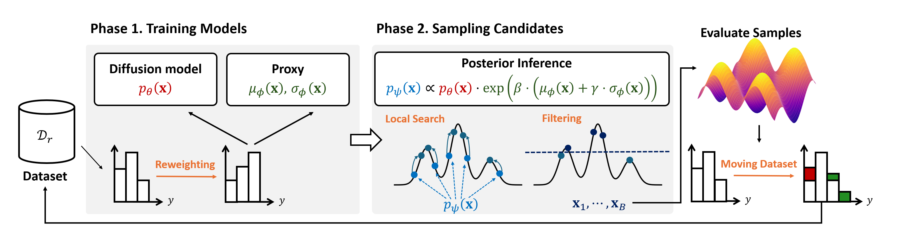

# Posterior Inference with Diffusion Models for High-dimensional Black-box Optimization (DiBO)

**Conference:** Accepted in ICML 2025


**Paper:** [OpenReview Link](https://openreview.net/forum?id=7VzwNqQu9x)

## 📖 Overview

This repository implements the **DiBO** method presented in our paper **"Posterior Inference with Diffusion Models for High-dimensional Black-box Optimization"**, accepted at **ICML 2025**. DiBO leverages diffusion models to perform efficient posterior inference, significantly enhancing performance in high-dimensional black-box optimization tasks.

For a visual explanation of the DiBO framework, please see the image below:



---

## 🛠 Installation Guide

To ensure the DiBO repository is correctly included in your Python path, add the following line to your shell configuration file (`.bashrc`, `.zshrc`, etc.):

```bash
nano ~/.bashrc  # or ~/.zshrc
```

Then add:

```bash
export PYTHONPATH=/home/name/DIBO:$PYTHONPATH
```

Reload your shell configuration with:

```bash
source ~/.bashrc  # or source ~/.zshrc
```

Alternatively, you can directly add the `export PYTHONPATH` line at the top of the [`baselines/scripts/dibo.sh`](baselines/scripts/dibo.sh) file.

### 🌱 Environment Setup

Follow these steps to set up the environment:

```bash
# Create and activate conda environment
conda create -n dibo python=3.9 -y
conda activate dibo

# Mujoco Installation (Ensure Mujoco is in ~/.mujoco)
pip install Cython==0.29.36 numpy==1.22.0 mujoco_py==2.1.2.14
pip3 install box2d-py Box2D

# Compile Mujoco
python -c "import mujoco_py"

# PyTorch Installation
pip install torch==1.13.1+cu117 torchvision==0.14.1+cu117 torchaudio==0.13.1 --extra-index-url https://download.pytorch.org/whl/cu117

# Additional Dependencies
pip install botorch==0.6.4 gpytorch==1.6.0
gym==0.13.1 attrdict==2.0.1 wandb==0.15.3 matplotlib==3.7.5
pandas==1.5.3 scikit-learn==1.2.2 tqdm==4.64.1

# Lasso Environment Dependencies
pip install celer
pip install "sparse-ho @ https://github.com/QB3/sparse-ho/archive/master.zip"
pip install libsvmdata pygame

# Troubleshooting for HalfCheetah
pip install --upgrade gym
```

### 🚀 Running Examples

To execute DiBO examples, run:

```bash
sh baselines/scripts/dibo.sh
```

All settings and scripts are available in the [`baselines/scripts`](baselines/scripts) directory.
